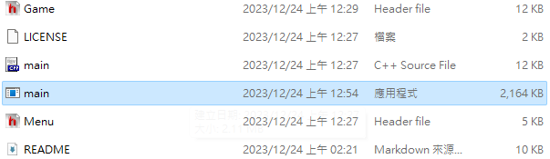
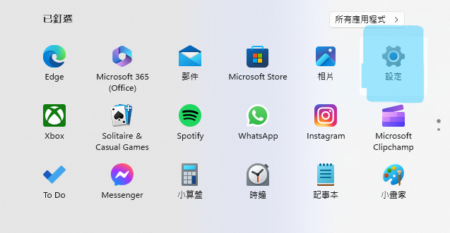
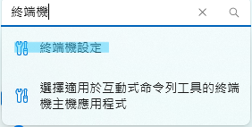
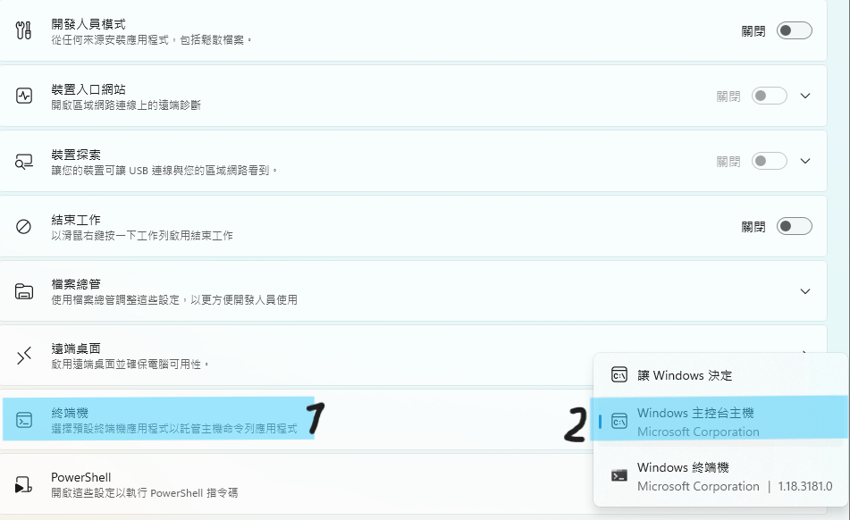
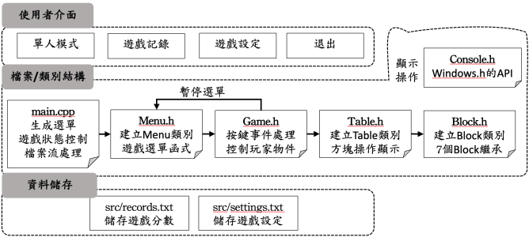

**2023 IM Program Designing Final Project - Tetris**
===
       
    
     -->
1. [What](#what)
2. [Team Member](#team-member)
3. [Requirement](#requirement)
4. [How to Play](#how-to-play)
5. [Architecture](#architecture)
6. [Version History](#version-history)
7. [Update Log](#update-log)

## What
---
Our project is to build a tetris game by "windows.h", allowing playing in single player or multi player mode(under construction).
## Team Member
---
| Name | Department | Student ID | Position|
| :--: | :--: | :--: | :--: |
| 趙子佾 | IM Freshman | B12705064 | PM, Programmer, UI/UX Designer, Architecture Designer |
| 詹詠翔 | IM Freshman | B12705063 | Programmer, API applying, UI/UX Designer |
| 陳泊華 | IM Freshman | B12705014 | Socket Programmer, Presentation, Report |
| 吳秉哲 | IM Freshman | B12705049 | Block Programmer, Presentation, Report |
## Requirement
---
This application is required to be running on windows 10 or newer.  
## How To Play
---
> ### Preparation
> [Windows 10](#windows-10)  
> [Windows 11](#windows-11)  
>> ### Windows 10
>> 1. Just click the main.exe in the repo, Enjoy  
>> 
>> ### Windows 11
>> 1. Open the settings in your computer, it may be in the Start Menu  
>> 
>> 2. Click the search bar and type "terminal" or "終端機", and click the first one.  
>> 
>> 3. Click the terminal, and select the second one.  
>> 
>> 4. Go to the repo folder, and click the main.exe, Enjoy  
>> 
 

> Keyboard Operation
> | KeyBoard | Left/Right Arrow | Down Arrow | Space | Up Arrow X | Z | C/Shift | P | Q |
> | :--: | :--: | :--: | :--: | :--: | :--: | :--: | :--: | :--: |
> | Function | Move Left/Right | Falling faster | Hard Drop | Rotate CW | Rotate CCW | Hold | Pause | Quit |
 

> Configurations Setting
> | Configuration Name | DAS | ARR | Gravity | Bright Mode |
> | :--: | :--: | :--: | :--: | :--: |
> | Function | Delay auto shift | Auto repeat rate | Dropping rate(down arrow) | Display mode |
> | Adjust Range | 1(slow)-1000(fast) | 1(slow)-500(fast) | 1(slow)-50(fast) | 1(dark)/2(bright) |

## Architecture
---
Our game is based on cpp, and UI/UX is powered by "windows.h".  
We would like to use socket as our api to transmit enemy player data by TCP protocol  
We about to use some techniques like File I/O, Polymorphism, Operator Overloading, Inheritance, Exception Handling, etc...  
And we divided our game architecture into several parts, listed at the below.  
>  
> 1. [Main.cpp](#maincpp)  
> 2. [Game.h](#gameh)  
> 3. [Menu.h](#menuh)  
> 4. [Console.h](#consoleh)  
> 5. [Table.h](#tableh)  
> 6. [Block.h](#blockh)  
> 7. [Socket (abstract)](#socket-abstract)  
>>- [Server.h](#serverh)  
>>- [Client.h](#clienth)  
>> ### Main.cpp
>> This contain game initailize and exit function that can input and output the data in the src  
>> And establish main menu based on Menu.h, providing below functions 
>> 1. Start playing in Infinite/Time/Clear Line mode
>> 2. Record, you can see your playing record and reset it
>> 3. Settings, which can adjust setting in the game
>> 4. Quit, safely exit the game
>> ### Game.h
>> This establish a whole gaming environment by some ways, listed at the below 
>> 1. Construct and maintain a class Table from Table.h
>> 2. Scan keyboard status asynchronously and do cooresponding operation
>> 3. Control player(class Table) depending on user input via keyboard
>> 4. Construct pause and quit menu based on Menu.h, providing pause/configuration settings/quit functions
>> ### Menu.h
>> This construct a Menu class that can provide a full functionally Menu, listed at the below 
>> 1. Hover and Highlight when cursor approaching
>> 2. Capable of include a Menu inside a Menu(sub menu)
>> ### Console.h
>> This provide some operations that control the console panel such that clrscr(clear screen),  MoveWindow(move the window and adjust console display size), etc...
>> ### Table.h
>> This establish a class that can control and display the whole player game board  It will scan the keyboard state and does cooresponding operation such that move or rotate the block and verify the validation of this operation  Block operations are provided and maintained by Block.h
>> ### Block.h
>> This contain struct Point(for coordinate) and class Block(abstract class)  Class Block save some general data of each block,  and provide some functions such that moving or rotating, etc...  And there are seven types of Block(I, J , K O, Z, T, S) derived from Block   Some block which is special will override some function in the abstract class Block.
>> ### Socket (abstract)
>> This is for transmit data of opponent and player
>>> ### Server.h
>>> This contain a function that establish socket connection.   And provide functions that can transmit and receive data from and to client side.
>>> ### Client.h
>>> This contain a function that can establish a socket connected to server side.   And provide functions that can trasmit and receive data from and to server side.

## Version History
---
&nbsp;&nbsp;&nbsp;&nbsp;&nbsp;&nbsp;
- [Version 5](#20231225c-v50beta) Multi Player Mode
> - [v5.0beta](#20231225c-v50beta)Socket applying construction
- [Version 4](#20231225a-v435) UI/UX improved
> - [v4.4](#20231225b-v44beta) File check and hold/next Title
> - [v4.3](#20231225a-v435) Table destructor
> - [v4.2](#20231222b-v42) Improve UI/UX by enable Square/Rect Font
> - [v4.1](#20231220a-v411) Fix stuck-wait Verdiction
> - [v4.0](#20231219b-v401) Big enhancement in Game UI/UX
- [Version 3](#20231218b-v31) Add Menu
- [Version 2](#20231217b-v26) UI/UX Improved by using background color
- [Version 1](#20231214a-v10) Single Player Mode Ready
- [Version 0](#20231213b-v017) Game Under Basic Construction

## Update Log
---
> ### 2023/12/26.c (v5.0beta)
> Trying to implement Board Data sending and receiving SOP  
> Multiplayer still have some problem in memory allocation(Table player)  
> Add multi player connecting function menu

> ### 2023/12/26.b (v4.5)
> Fixed server/client header file  
> Example file included

> ### 2023/12/26.a (v4.4)
> Verify beta version  
> Add chk pic.txt

> ### 2023/12/25.b (v4.4beta)
> Add file checking function  
> Add title on hold and next

> ### 2023/12/25.a (v4.3.5)
> Verify beta version  
> Completed Upgrade README.md

> ### 2023/12/24.d (v4.3.5beta)
> Add Table destructor

> ### 2023/12/24.c (v4.3.4)
> Fix Combo digit bug  
> modify clrscr()  
> README.md under updating

> ### 2023/12/24.b
> Upgrade README.md

> ### 2023/12/24.a (v4.3.3)
> Fixing waiting time when block is stucked

> ### 2023/12/22.i
> Completed comment on Main.cpp

> ### 2023/12/22.h
> put comment on Table

> ### 2023/12/22.g (v4.3.2)
> Fixed the bug that block stucked can never be fixed  
> Completed Game.h's comment 

> ### 2023/12/22.f (v4.3.1)
> Bug about quit menu was fixed by flushing the input console

> ### 2023/12/22.e (v4.3beta)
> add comment on Block.h  
> Add pause menu and quit menu(some isuue need to be fixed)  
> Add setting fn in pause menu

> ### 2023/12/22.d
> add comment for Table.h

> ### 2023/12/22.c
> Game.h's comment is nearly finished (pause and quit function left)  
> Completed comment on Conosle.h

> ### 2023/12/22.b (v4.2)
> Improve UX by enhancing SetFont function(square or rect)

> ### 2023/12/22.a
> Complete comment on VK.h, Server.h and Client.h  
> Block.h's comment is near completed, remain 7 block derive class

> ### 2023/12/20.a (v4.1.1)
> Fixed b2b and tspin  
> Improve stuck_wait verdiction

> ### 2023/12/19.e (v4.1)
> Added 啪沒了 
> Fixed the FullScreen function 
> Fixed the bug that sometimes content isn't fully shown

> ### 2023/12/19.d (v4.0.3beta)
> Add get score bar  
> Fixed the bug that block can sometimes never fixed in place  
> Fixed the bug that menu never clears

> ### 2023/12/19.c (v4.0.2beta)
> Improve UI  
> Multiplaying exception catching stiil need to be fixed  
> Server/Client header file has completed

> ### 2023/12/19.b (v4.0.1)
> Fixed the big that Kick Table is not always correct  
> Fixed the bug that T-spin is not showing

> ### 2023/12/19.a (v4.0)
> Big Improve in game display  
> reEnabling the #define FONT flag  
> Fixed holding input condition  
> Improve menu UI  
> Add record menu

> ### 2023/12/18.f (v3.3.1beta)
> Improve menu  
> Input still need to be fix (if input char...)

> ### 2023/12/18.e (v3.3beta)
> Added sub menu  
> Fixed the bug that record and setting aren't saving

> ### 2023/12/18.d (v3.2.1beta)
> Add b2b chk function

> ### 2023/12/18.c (v3.2beta)
> Add arr function  
> add debug function (by #define DEBUG)  
> there is some problem in block clone() or memory allocation

> ### 2023/12/18.b (v3.1)
> Create timer in the game table  
> Create new option : Quit  
> allow give in challenge mode 0:infinite, 1:line, 2:time

> ### 2023/12/18.a (v3.0beta)
> Changed from Menu.cpp to Menu.h  
> Added console.h from console operations
> Game's bug is yet to be fix (happens when new_block(), possibly because of delete current)

> ### 2023/12/17.b (v2.6)
> Refine game.h and table.h  
> Add pause and quit function  
> Add display of line clear status  
> Menu will be added later

> ### 2023/12/17.a (v2.5.2beta)
> Added Menu.cpp  
> Added a new game menu  
> The game is still broken
  
> ### 2023/12/16.c (v2.5beta)
> Encapsulated game_cycle
> Finish isT_spin chk, board de/compression
> Merge Conflict

> ### 2023/12/16.b (v2.4.1)
> fix hold can be used twice in a cycle

> ### 2023/12/16.a (v2.4)
> Rebuild game architecture by encapsulate game playing section  
> Added singlePlayer and multiPlayer func.  
> Added game_init/exit, record_update/reset, conf setting func.  
> Finishing the part of record playing data and settings (record reset, conf setting, etc...)  
> Create bright/dark mode

> ### 2023/12/15.d (v2.3.1beta)
> Fixed the bug that blocks can sometimes pass through each other  
> Added the function "single_player()"
> Trying to add a new menu

> ### 2023/12/15.c (v2.3beta)
> Refine socket server-client mechanism

> ### 2023/12/15.b (v2.2.1)
> Complete block keep (need to complete keep block display)

> ### 2023/12/15.a (v2.2)
> Fix some bugs  
> Complete game over and verify every Block's rotation  
> Modify our introduction  
> Create game menu (when game is over) (can be better)

> ### 2023/12/14.g (v2.1)
> Add server.h v1
> Add client.h v1

> ### 2023/12/14.f (v2.0.2)
> Fixed delta Position of Block_I rotation

> ### 2023/12/14.e (v2.0.2beta)
> Fixed display issue by adding Block *before  
> Added SetFont()  
> Modified print_block()

> ### 2023/12/14.d (v2.0.1beta)
> Fixed Block_I rotation (still need to implement delta in x/y axis)

> ### 2023/12/14.c (v2.0)
> Fix bugs  
> Improve color displaying (clear column)

> ### 2023/12/14.b (v1.1beta)
> finished hard_drop fix_line and line_clear

> ### 2023/12/14.a (v1.0)
> Fix some major issue in game 
> Fix isValid bug 
> Fix rotating bug 
> changed y-axis direction 
> Change block verifying in table.h 
> this version has completed some major function in tetris

> ### 2023/12/13.b (v0.17)
> Fixed the copy issue by adding clone 
> Added createKickTable  
> Changed some Block into Block* in order to fix block-copy issue

> ### 2023/12/13.a (v0.16.1)
> Fixed some bugs

> ### 2023/12/12.g (v0.16)
> finished key timer

> ### 2023/12/12.f (v0.15)
> finished remove line

> ### 2023/12/12.e (v0.14)
> add_shuffle_block 
> Finished hard_drop

> ### 2023/12/12.d
> Fixed conflict

> ### 2023/12/12.c (v0.13)
> turn current's type from block to block_pointer  
> fixed block printing  
> XDTurtleXD is horny  

> ### 2023/12/12.b (v0.12.3beta)
> Rearrange main function  
> Set randomizing block  
> Turn 'id' into 'board'  

> ### 2023/12/12.a (v0.12.2beta)
> Temporary merge  
> Fix move_block  

> ### 2023/12/11.a (v0.12.1beta)
> Finish all the initialize of seven blocks(using the "location" point)
> 
> ### 2023/12/07.a (v0.12beta)
> Add I block kick table  
> Add I block rotate_set function (still working on)  
> Modify rotate_set function  
> Add rotating detection in main

> ### 2023/12/01.b (v0.11beta)
> Add key press detector  
> print_block is yet to be fixed

> ### 2023/12/01.a (v0.10.1)
> Simplify the basic data of block (symbol, color => id)

> ### 2023/11/30.d (v0.10)
> Change the architecture of block and table

> ### 2023/11/30.c (v0.9.2)
> Small modify in block.h

> ### 2023/11/30.b (v0.9.1)
> Add symbol matrix in table.h, complete some functions in table.h  
> modify flush_tick, cols lines, etc... in main.cpp

> ### 2023/11/30.a (v0.9)
> Fix print_table()

> ### 2023/11/29.e (v0.8.1)
> Fix conflict  
> modify constructor

> ### 2023/11/29.d (v0.8)
> Add some foundmental constuctor to the different type block,
> the initialize is not done yet

> ### 2023/11/29.c (there is a typo "2023/11/28.c") (v0.7.2)
> Debug block.h and creating kick table and implement to rotation  
> Merge conflict

> ### 2023/11/29.b (v0.7.1beta)
> Debug table.h

> ### 2023/11/29.a (v0.7beta)
> Implement print_table aand print_block in table.h

> ### 2023/11/28.e (v0.6.3)
> Debug table.h and block.h

> ### 2023/11/28.d (v0.6.2)
> Change class name to upper case

> ### 2023/11/28.c (v0.6.1)
> Debug table.h and add some detail in table.h

> ### 2023/11/28.b (v0.6)
> Create some functions in block

> ### 2023/11/28.a (v0.5)
> Debug table.h and block.h  
> Add some abstract function to make it more completed  
> Work has been distributed  

> ### 2023/11/24.a (v0.4.1)
> Debug table.h

> ### 2023/11/23.g
> Reorder the README

> ### 2023/11/23.f (v0.4)
> Create some functions which involve in moving or rotating blocks in table.h

> ### 2023/11/23.e (v0.3.1)
> Create every specific shape block class which inherits general block class

> ### 2023/11/23.d (v0.3)
> Create some functions which control the existence of block in table.h

> ### 2023/11/23.c
> Merge test

> ### 2023/11/23.b (v0.2.1)
> Establish block::block_position

> ### 2023/11/23.a (v0.2)
> Modify the rotating strategy, construct point struct

> ### 2023/11/21.b
> Hi

> ### 2023/11/21.a
> Include "windows.h", add compiler optimizing pragma

> ### 2023/11/17.b
> Create gitignore

> ### 2023/11/17.a (v0.1)
> Create position returning function of "block.h"  
> Change our block data container from STL to C++ basic container (int/short...)

> ### 2023/11/16 (v0.0)
> Construct the repository  
> Create "main.cpp", "block.h", "table.h"
